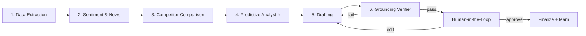

# Agent Workflow

Six agents run as LangGraph nodes. The first three gather and enrich evidence, the fourth
predicts questions, the fifth drafts, the sixth verifies — then a human approves.



| # | Agent | Job | Output in state | Detail |
|---|---|---|---|---|
| 1 | **Data Extraction** | Pull all quarterly financials + ratios; validate & normalize with provenance | `facts: list[FinancialFact]` | [Data Sources](data-sources.md), [Grounding](grounding.md) |
| 2 | **Sentiment & News** | Search news + social; classify with FinBERT; summarize narrative + risk topics | `sentiment: SentimentSnapshot` | [Sentiment](sentiment.md) |
| 3 | **Competitor Comparison** | Benchmark the company vs peers on the same metrics; flag where it leads/lags | `peer_comparison: PeerComparison` | [Competitor](competitor.md) |
| 4 | **Predictive Analyst** ⭐ | RAG over transcripts/filings/competitor calls + sentiment + peer gaps to predict the hardest investor questions | `predicted_questions` | [Fine-tuning](finetuning.md), [Wiki](wiki-ingestion.md) |
| 5 | **Drafting** | Synthesize script + deck outline + Q&A cheat sheet; numbers **slotted**, not generated | `draft: DraftBundle` | below |
| 6 | **Grounding Verifier** | Re-check every numeric token + claim against evidence; block/flag unsupported | `verification: VerifyReport` | [Grounding](grounding.md) |
| — | **Human-in-the-Loop** | Pause; reviewer approves/edits each section; edits feed back | `human_feedback` | [UI](ui.md) |

## 1. Data Extraction Agent

Maps the user's ticker + quarter to a complete, typed [Financial Fact Store](grounding.md).
Every metric (TTM EPS/PE, market cap, PS/PB/PEG, ROE/ROA/ROIC/WACC, equity multiplier, asset
turnover, revenue by segment & geography, income statement) becomes a `FinancialFact` with a
source URL and an `as_of` date. Missing metrics are recorded as explicit gaps (not silently
dropped) so the coverage check can flag them later.

## 2. Sentiment & News Agent

See [Market Sentiment](sentiment.md). Produces a `SentimentSnapshot` with net score, top
positive/negative themes, and the "topics investors are angry about" — which become inputs to
question prediction.

## 3. Competitor Comparison Agent

See [Competitor Comparison](competitor.md). Runs **before drafting** so the script can address
relative performance proactively, and feeds the Predictive Analyst (a peer gap is a likely
hard question, e.g. *"Your gross margin trails AMD by 600 bps — why?"*).

## 4. Predictive Analyst Agent ⭐

The headline-intelligence step and the target of [fine-tuning](finetuning.md). It assembles a
**tagged, cited evidence brief** — segment/geo YoY swings, peer lags, sentiment concerns, and
real precedent analyst questions from the [wiki](wiki-ingestion.md) — then:

- **LLM path** (`LLM_BACKEND=vllm`): the model **authors** the hardest, most natural questions
  from that evidence, citing the evidence tag for each. Any question containing a number not in
  the allowed set (facts + peer values + signal %) is dropped, so questions never carry an
  invented figure. This is the production / fine-tuned path (`agents/briefing.py`).
- **Offline path** (`chat=None`): deterministic grounded templates from the same evidence.

Either way it emits a ranked list of `Question`s, each with a *why* and evidence chips.

```python
class Question(BaseModel):
    text: str
    difficulty: float          # 0–1, model-scored
    rationale: str             # why investors will ask this
    evidence: list[str]        # fact_ids + wiki chunk ids
    suggested_answer: str      # drafted in node 5
```

## 5. Drafting Agent

Produces three artifacts in one `DraftBundle`:

```python
class DraftBundle(BaseModel):
    script: list[ScriptSection]     # CEO/CFO prepared remarks
    deck_outline: list[Slide]       # bullet points per slide
    qa_cheat_sheet: list[Question]  # question → suggested answer → backing facts
```

- **LLM path** (`LLM_BACKEND=vllm`): the model **writes** the prepared remarks, deck bullets,
  and CEO/CFO answers in natural prose, inserting a **slot token** (`{{F-0012}}`) for every
  figure. The rendered bundle is grounding-checked before use; if the model leaks an ungrounded
  number, drafting **falls back to the grounded templates** automatically.
- **Offline path** (`chat=None`): deterministic grounded templates.

In both paths a deterministic renderer substitutes verified values from the Fact Store — the
model controls *prose*, never *numbers*. See [Grounding](grounding.md).

## 6. Grounding Verifier

A deterministic numeric check + an NLI claim check + a coverage check. On failure the graph
loops back to **Drafting** (conditional edge); on pass it proceeds to the human gate. Full
algorithm in [Grounding & Evidence](grounding.md).

## Shared state

```python
class IRState(TypedDict):
    ticker: str
    period: str
    facts: list[FinancialFact]
    sentiment: SentimentSnapshot
    peer_comparison: PeerComparison
    predicted_questions: list[Question]
    draft: DraftBundle
    verification: VerifyReport
    human_feedback: HumanEdit | None
    messages: Annotated[list, add_messages]
```

The wiring of these nodes into a `StateGraph`, the interrupt, and streaming are in
[LangGraph Orchestration](orchestration.md).
