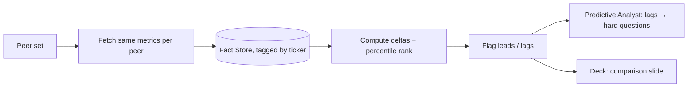

# Competitor Comparison

A dedicated agent that benchmarks the company against its peers on the **same metrics**, runs
**before drafting**, and feeds both the deck and the Q&A.

## Why before drafting

- The **script** can proactively address relative performance ("our margins lead the peer
  group", or get ahead of a weak spot).
- The **Predictive Analyst** treats every peer gap as a likely hard question
  (*"Your gross margin trails AMD by ~600 bps — what's the path back?"*).
- The **deck** gets a clean comparison slide.

## How it works

1. Resolve a peer set (config per ticker, e.g. `NVDA → [AMD, INTC, AVGO]`; or sector-based).
2. For each peer, pull the same metrics via [defeatbeta-api](data-sources.md) into the
   [Fact Store](grounding.md) (tagged by ticker) — so peer numbers are grounded too.
3. Compute deltas and percentile rank per metric; flag leads/lags beyond a threshold.
4. Optionally retrieve peer **earnings-call** context from the [wiki](wiki-ingestion.md) to
   explain a gap with evidence.

```python
class PeerMetric(BaseModel):
    metric: str
    company_value: float
    peer_values: dict[str, float]     # {"AMD": ..., "INTC": ...}
    rank: int                         # 1 = best in peer set
    delta_vs_best: float
    fact_ids: list[str]               # provenance for every value

class PeerComparison(BaseModel):
    peers: list[str]
    metrics: list[PeerMetric]
    leads: list[str]                  # metrics where company leads
    lags: list[str]                   # metrics where company lags  → feeds Q&A
```



## Grounding

Every peer value is a `FinancialFact` with its own source — the comparison is fully cited, and
the numeric [verifier](grounding.md) covers peer numbers the same way it covers the company's.

## Output placement

- **Deck outline:** a "Competitive Position" slide.
- **Q&A cheat sheet:** each material lag becomes a predicted question with a grounded suggested
  answer.
- **Script:** optional proactive framing of relative performance.
