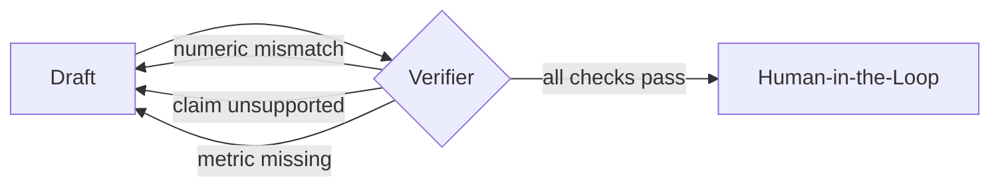

# Grounding & Evidence

This is the differentiator: **no missing numbers, no hallucinated numbers, every claim cited.**
It is enforced by construction (numbers are data, not generations) and then re-checked by a
verifier node before any human ever sees the draft.

## 1. Financial Fact Store (single source of truth)

Numbers live only here. The LLM receives fact IDs + values and writes **slots**, never
free-form digits.

```python
class FinancialFact(BaseModel):
    metric: str             # "ttm_eps"
    period: str             # "FY2026Q1"
    value: float
    unit: str               # "USD" | "%" | "x" | "USD_bn"
    source: str             # "defeatbeta-api:ttm_eps" | "yfinance:market_cap"
    source_url: str | None  # SEC filing / dataset URL
    as_of: date
    fact_id: str            # stable hash → cited in UI as [F-0007]
```

Built by the [Data Extraction Agent](agents.md) from [defeatbeta-api](data-sources.md).

## 2. Slotting (the model never writes a number)

The Drafting Agent emits prose with fact slots:

```
"Revenue was {{F-0012}}, up {{F-0018}} year over year, lifting TTM EPS to {{F-0003}}."
```

A deterministic renderer substitutes verified values:

```python
def render(text: str, facts: dict[str, FinancialFact]) -> str:
    return re.sub(r"\{\{(F-\d+)\}\}", lambda m: fmt(facts[m.group(1)]), text)
```

If the model writes a slot that doesn't exist, rendering fails loudly — it cannot silently
invent a figure.

## 3. Grounding Verifier node

Runs after drafting; on any failure the graph loops back to **Drafting**.



### a) Numeric grounding (no hallucinated numbers)

Extract every numeric token from the **rendered** text and assert each matches a Fact-Store
value within tolerance. Any unmatched number blocks the draft.

```python
def check_numbers(text: str, facts: list[FinancialFact]) -> list[Violation]:
    allowed = {round(f.value, 4) for f in facts} | derived_values(facts)  # ratios, deltas
    return [Violation("ungrounded_number", tok)
            for tok in extract_numbers(text)
            if round(tok, 4) not in within_tol(allowed)]
```

### b) Claim grounding (NLI)

Non-numeric claims (e.g. *"demand accelerated in EMEA"*) are checked for entailment against the
retrieved [wiki](wiki-ingestion.md) evidence, using Llama-3.1-8B as an entailment judge on the
MI300X. Unsupported → flagged for the human (not silently kept).

### c) Coverage (no missing numbers)

Assert every **required** metric for the period appears in the script/cheat-sheet
(revenue, EPS, margins, guidance, segment/geo revenue...). Missing → flagged in the HITL panel.

```python
REQUIRED = {"revenue", "ttm_eps", "gross_margin", "operating_margin", "guidance",
            "revenue_segment", "revenue_geo"}
def check_coverage(draft, facts) -> list[str]:
    present = metrics_mentioned(draft)
    return [m for m in REQUIRED if m not in present and has_fact(facts, m)]
```

## 4. Evidence chips (auditable UI)

Every rendered sentence carries provenance the reviewer can tap:

```python
class EvidenceChip(BaseModel):
    fact_ids: list[str]      # e.g. ["F-0012", "F-0018"]
    wiki_chunks: list[str]   # supporting passages for narrative claims
    label: str               # "Revenue $X, FY2026Q1 — SEC 10-Q"
    url: str | None
```

In the UI these render inline (`[F-0012]`) and expand to metric, value, period, and source
URL. See [UI](ui.md).

## Why this satisfies "no missing, no hallucination"

- **Hallucinated numbers:** impossible by slotting; doubly caught by the numeric verifier.
- **Missing numbers:** the coverage check fails the draft until required metrics are present.
- **Unsupported narrative:** flagged by NLI for human judgment.
- **Auditability:** the reviewer approves with evidence visible per sentence.

How this is proven with metrics is in [Evaluation](evaluation.md).
