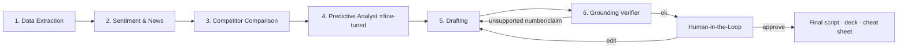

# IR-Copilot

### Autonomous Earnings Call Script, Deck & Q&A Cheat-Sheet
A grounded, multi-agent **Investor-Relations** workflow on **AMD MI300X (ROCm + vLLM)**.

---

> **One-liner:** Ingest a company's quarterly financials, benchmark it against competitors,
> predict the hardest questions institutional investors will ask, and autonomously draft a
> compliant earnings-call **script**, a **slide-deck outline**, and a CEO/CFO **Q&A Cheat
> Sheet** — with **every number and claim traced to evidence**, served by **open-source LLMs
> on AMD MI300X**, and reviewed **with a human in the loop** through a live, streaming UI.

## The problem

Before every quarterly earnings call, the IR team spends 1–2 weeks manually pulling
financials, reading competitor calls, guessing analyst questions, drafting the CEO script,
building the deck, and prepping a Q&A cheat sheet. It is slow, repetitive, and **a single
wrong number on a live call is a compliance/market event**.

## The solution

A six-agent LangGraph workflow that compresses that work to minutes, with **zero tolerance
for wrong numbers** and a **human approval gate** before anything is finalized.

## What this hits (judge-facing scorecard)

| Required capability | How we deliver it |
|---|---|
| **AMD ROCm + vLLM (critical)** | All generation / reasoning / embedding models served by **vLLM on ROCm**, on a single **MI300X** (192 GB HBM3e → no quantization, large models full-precision). See [AMD MI300X + vLLM](rocm-vllm.md). |
| **Fine-tuning (MOST critical)** | **Unsloth QLoRA** fine-tune of the Predictive-Analyst model → higher question recall **and** big prompt-token savings. See [Fine-tuning](finetuning.md). |
| **LangGraph** | 6-node multi-agent state machine with a **human-in-the-loop interrupt** and streaming. See [Orchestration](orchestration.md). |
| **Qdrant (vector DB)** | A knowledge "wiki at scale" — transcripts, filings, news **and custom PDF / image / audio / video** sources. See [Knowledge Wiki](wiki-ingestion.md). |
| **RAG / wiki at scale** | Confirmed-evidence-only multimodal index with reranked retrieval. |
| **Open-source models only** | Llama-3.1, Mistral, DeepSeek-R1-Distill, BGE embeddings, FinBERT, Whisper — all Hugging Face. |
| **No missing / hallucinated financials** | A **Financial Fact Store** + **numeric grounding verifier**. See [Grounding](grounding.md). |
| **Grounding & evidence everywhere** | Every sentence carries a tappable evidence chip (metric, value, period, source URL). |
| **Human in the loop** | LangGraph `interrupt` → reviewer approves/edits in the UI. |
| **Streaming backend → UI** | Agent state streamed live via **CopilotKit AG-UI**; Flutter GenUI optional. See [UI](ui.md). |
| **Yahoo Finance / defeatbeta-api** | Primary data via `defeatbeta-api`; `yfinance` fallback. See [Data Sources](data-sources.md). |
| **News / social sentiment** | News-search + FinBERT → a Market Sentiment view. See [Sentiment](sentiment.md). |
| **Competitor comparison** | Dedicated agent before drafting; surfaced in the deck and Q&A. See [Competitor](competitor.md). |
| **Kaggle / HF demo data** | HF earnings-call + financial-phrasebank; Kaggle Motley-Fool transcripts. |

## How to read these docs

- Start with **[Architecture](architecture.md)** for the system shape.
- **[Agent Workflow](agents.md)** describes the six agents in order.
- The **Platform** section is where the AMD/vLLM, LangGraph, and UI specifics live.
- **[Fine-tuning](finetuning.md)** is the headline feature — scheduled flexibly across the
  4-day hackathon (see the [Roadmap](roadmap.md)).
