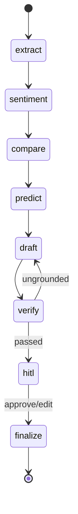

# LangGraph Orchestration

The six [agents](agents.md) are nodes in a LangGraph `StateGraph` with a verifier retry loop,
a **human-in-the-loop interrupt**, a checkpointer for resume, and streaming to the UI.

## Graph

```python
from langgraph.graph import StateGraph
from langgraph.checkpoint.memory import MemorySaver

g = StateGraph(IRState)
g.add_node("extract",    data_extraction_agent)
g.add_node("sentiment",  sentiment_news_agent)
g.add_node("compare",    competitor_comparison_agent)
g.add_node("predict",    predictive_analyst_agent)   # fine-tuned model
g.add_node("draft",      drafting_agent)
g.add_node("verify",     grounding_verifier)
g.add_node("hitl",       human_review_node)
g.add_node("finalize",   finalize_and_learn)

g.set_entry_point("extract")
g.add_edge("extract", "sentiment")
g.add_edge("sentiment", "compare")
g.add_edge("compare", "predict")
g.add_edge("predict", "draft")
g.add_edge("draft", "verify")
g.add_conditional_edges(            # verifier blocks ungrounded content
    "verify", lambda s: "hitl" if s["verification"].passed else "draft")
g.add_edge("hitl", "finalize")

graph = g.compile(
    checkpointer=MemorySaver(),     # SQLite in prod → resume after human edit
    interrupt_before=["hitl"],      # ← HUMAN-IN-THE-LOOP gate
)
```



## Streaming

```python
async for event in graph.astream(initial_state, config, stream_mode="updates"):
    for node, partial in event.items():
        await publish(node, partial)   # → CopilotKit AG-UI state / Flutter A2UI
```

`stream_mode="updates"` emits each node's partial output as it completes, so the UI fills in
the Financial Snapshot, Sentiment, Competitor, Predicted Q&A, and Draft views progressively.
See [UI](ui.md).

## Human-in-the-loop

- Execution **pauses** at `interrupt_before=["hitl"]`.
- The UI shows the draft with evidence chips and an Approve / Edit / Regenerate control.
- Resume with the human's decision:

```python
graph.ainvoke(Command(resume=human_edit), config={"configurable": {"thread_id": tid}})
```

- An **edit** routes back through `draft` (re-verified); an **approve** proceeds to `finalize`.
- With CopilotKit this surfaces via `useLangGraphInterrupt`; with Flutter via a
  `UserActionEvent`. See [UI](ui.md).

## Checkpointer & resume

`MemorySaver` (demo) / SQLite (prod) persists state per `thread_id`, so a paused run survives
and resumes exactly where it stopped after the human acts — no recomputation of prior nodes.

## Learning loop (finalize)

`finalize_and_learn` writes the approved Q&A and reviewer notes back to the
[Qdrant wiki](wiki-ingestion.md), so next quarter's [Predictive Analyst](agents.md) retrieves
real, confirmed precedents — the same confirmed-only write-back discipline used for retrieval
quality.

## Exposing the graph to the UI

The graph is served to CopilotKit via the `copilotkit` Python SDK
(`add_fastapi_endpoint` + `LangGraphAgent`, AG-UI protocol) — see [UI](ui.md) for both the
CopilotKit and the optional Flutter transport.
