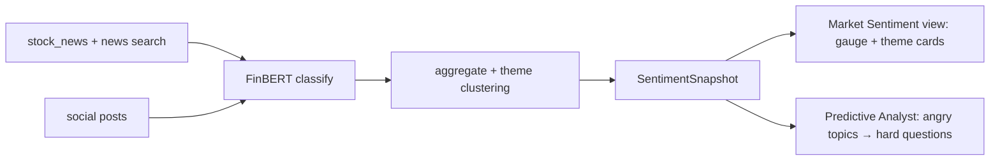

# Market Sentiment

The Sentiment & News Agent builds a `SentimentSnapshot` for the ticker from recent news and
social posts, classified with **FinBERT**. It both populates a dedicated UI view and feeds the
[Predictive Analyst](agents.md) — *what investors are angry about today is what they will ask
about on the call.*

## Sources

| Signal | Source |
|---|---|
| News headlines | `defeatbeta-api.stock_news()` + a news-search tool (WebSearch / free News API) |
| Social posts | Kaggle/HF stock-tweets dataset for the demo (pluggable live source) |

## Classification

- **Model:** `ProsusAI/finbert` — finance-tuned sentiment (positive / negative / neutral),
  run via transformers on the MI300X (or vLLM if served).
- **Aggregation:** weight by recency and reach; cluster into themes with embeddings.

```python
class SentimentSnapshot(BaseModel):
    net_score: float                  # -1 … +1
    positive_themes: list[Theme]
    negative_themes: list[Theme]      # "topics investors are angry about"
    sources: list[Citation]           # headlines/posts backing each theme

class Theme(BaseModel):
    label: str                        # "AI capex digestion fears"
    score: float
    evidence: list[Citation]          # source URLs — grounding
```

## Flow



## Grounding

Every theme keeps the source headlines/posts that produced it (`evidence`), so the sentiment
view is as auditable as the financial claims — consistent with the
[grounding model](grounding.md).

## In the UI

A net-sentiment **gauge** plus **theme cards** (positive/negative) with tappable source
citations. Streamed live as the agent runs — see [UI](ui.md).
