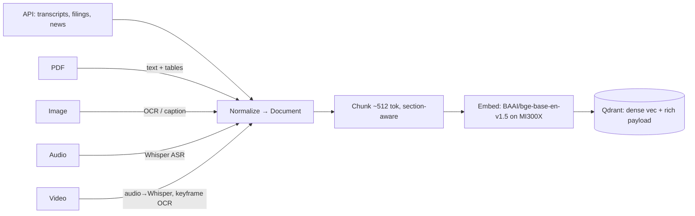

# Knowledge Wiki (RAG at scale)

The "IR Wiki" is a **Qdrant** collection of everything an analyst would read before a call —
built from **API sources and custom files alike**: PDFs, images, and audio/video transcripts.
It powers the [Predictive Analyst](agents.md) and supplies the evidence chips that make every
claim auditable.

> **Vector store:** Qdrant is primary (payload-filtered hybrid search at scale). ChromaDB is a
> drop-in fallback behind a `VectorStore` protocol — switch with `VECTOR_BACKEND=chroma`.

## Sources (multimodal)

| Source type | Examples | Ingestion |
|---|---|---|
| **API** | defeatbeta-api transcripts, SEC filings, stock news, competitor calls | direct fetch |
| **PDF** | 10-K/10-Q, analyst reports, investor decks | `pymupdf` / `unstructured` text + table extraction |
| **Images** | scanned filings, slide screenshots, charts | OCR (`rapidocr` / `tesseract`); chart captions via a vision model |
| **Audio** | recorded earnings calls, management interviews | **Whisper** ASR (served on MI300X) → transcript |
| **Video** | webcast replays, conference talks | extract audio → Whisper; optional keyframe OCR |

All sources converge into the same normalized **Document → Chunk** shape, so retrieval is
modality-agnostic and every chunk keeps a back-reference to its origin.



## Pipeline

1. **Normalize** every source into a `Document` with metadata
   `{ticker, doc_type, period, speaker, role(analyst|exec), source_url, modality}`.
2. **Chunk** to ~512 tokens, sentence-aware, tagged by section (prepared remarks vs Q&A).
3. **Embed** with `BAAI/bge-base-en-v1.5` via vLLM `/v1/embeddings` on the MI300X
   ([serving](rocm-vllm.md)). This embedder is a **drop-in swap target** — a
   [finance-tuned embedding model](finetuning.md#secondary-stretch-fine-tune-the-embedding-model)
   (stretch) replaces it with no other pipeline changes to better capture financial jargon.
4. **Upsert** to Qdrant with the payload above plus `char_span` for precise citation.

```python
class WikiChunk(BaseModel):
    chunk_id: str
    text: str
    ticker: str
    doc_type: str          # transcript | filing | news | pdf | image | audio | video
    period: str | None
    role: str | None       # analyst | exec
    source_url: str
    modality: str
    char_span: tuple[int, int]
```

## Retrieval (hybrid + reranked, cited)

```python
def retrieve(query: str, ticker: str, k: int = 8) -> list[WikiChunk]:
    qvec = embed(query)                                  # bge on MI300X
    hits = qdrant.search(
        collection="ir_wiki", query_vector=qvec, limit=40,
        query_filter=Filter(must=[FieldCondition(key="ticker", match=MatchValue(ticker))]),
    )
    reranked = bge_reranker.rerank(query, [h.payload["text"] for h in hits])[:k]
    return [to_chunk(h) for h in reranked]               # each carries source_url + span
```

- **Hybrid:** dense vector + payload filter (ticker/period/role). Add sparse/BM25 if time
  allows for exact-term recall on metric names.
- **Rerank:** BGE reranker top-k for precision.
- **Confirmed-only indexing:** only sourced, factual chunks are indexed; speculative text is
  excluded so retrieval never surfaces unsupported claims.

## Scale

Demo corpus: ~40 target-company calls, ~200 competitor calls, ~50 filings, rolling news, plus
any custom PDFs/recordings the IR team drops in. The same pipeline scales to millions of
chunks — Qdrant handles payload-filtered ANN search at that size.

## Learning loop

After the human approves a draft, the approved Q&A and any reviewer notes are written back to
the wiki, improving next quarter's predictions. Wiring is in
[LangGraph Orchestration](orchestration.md).
